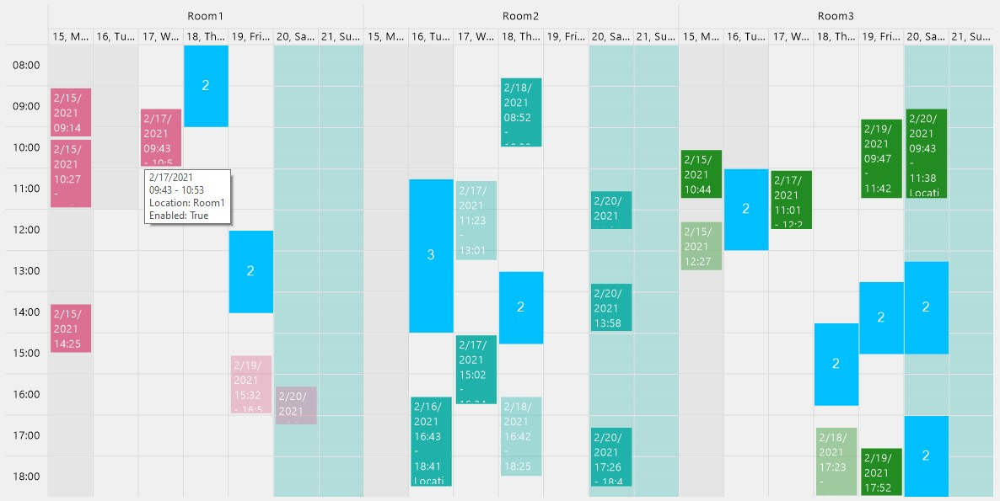

# DrawnTable
Custom WinForms control based on PictureBox for creating versatile tables.<br/>
It's fast, uses almost no memory, doesn't have any dependencies, and not limited by limitations of WinForms since it draws itself from scrach.



## Installation

Get it from NuGet: [](https://www.nuget.org/packages/DrawnTable/)

## Features
- Cell Drag & Drop
- Subheaders
- Cell Copy & Paste (using Ctrl + drag)
- Headers can span multiple rows (or columns)
- Cells can span multiple rows
- Cells can overlap each other (they will be merged or replaced placeholder)
- Cell styling (font, backound color, margin, text aligment)
- Table styling (font, background color, border color)
- Printing support (you can print the table or draw it using your `Graphics` instance)
- Cells can be disabled (user cannot interact with them)
- ToolTip for cells
- Supported events:
  - CellWithValueClick, CellOverlapPlaceholderClick
  - CellCreating, CellCreated
  - CellCopied, CellPasted
  - CellDragOver, CellDragDropFinished
  - CellsMerging

## Initialization

Before using the control you need to initialize it by providing list of row and column configurations:
```cs
drawnTable.Table.Create(Rows, Cols);
```

There is `HeaderCreator` class that can help you create those configurations. For example here's how to generate headers for a range of dates, and then get header index for some date:
```cs
HeaderCreator headers = new();
var columns = headers.Day.GenerateHeaders(dayStart, dayEnd, colFilter, "dd.MM, dddd");
...
int columnIndex = headers.Day.GetIndexByValue(date);
```
See demo appication for more usage samples.


